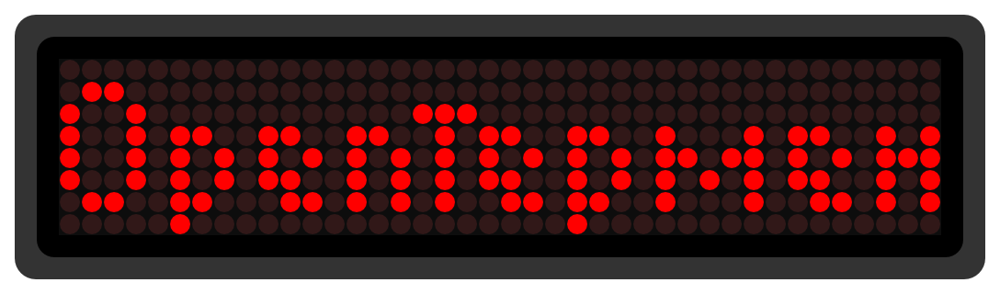
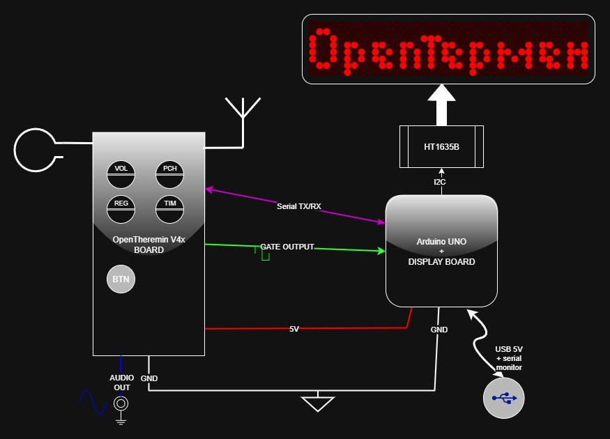
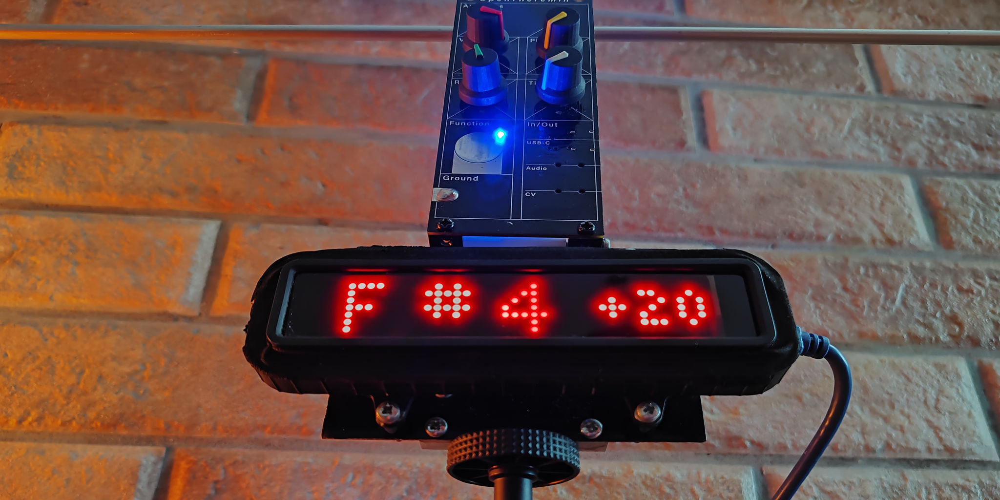
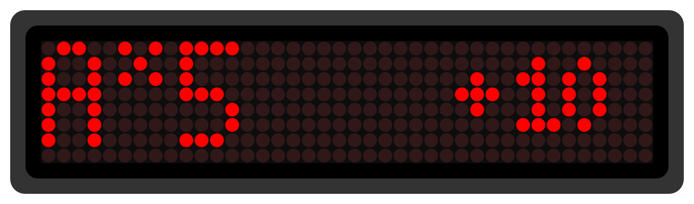
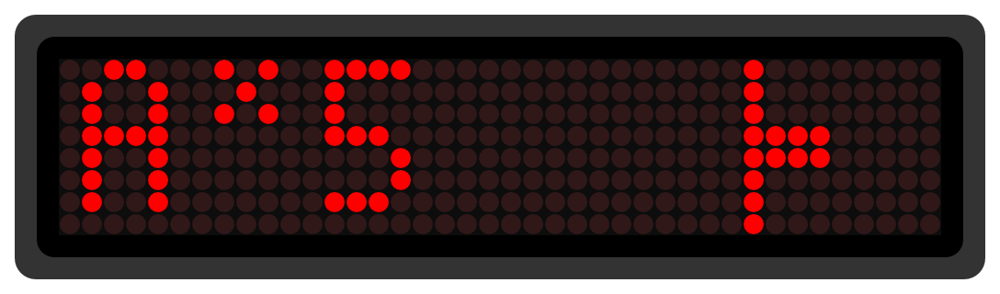
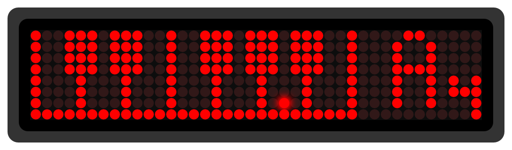

# OpenTheremin4+ Pitch Detection — Proof of Concept

> A modification and proof-of-concept project for the OpenTheremin V4 instrument, adding an LED matrix display for precise pitch and note indication.

## Quick Start

**What you need:**
- OpenTheremin V4.x board (assembled)
- Arduino UNO board
- HT1635A-based LED matrix board with 5× 8×8 modules
- Dupont wires (for serial TX/RX and I2C)
- PlatformIO installed in VS Code

**Wiring overview:**
1. **OpenTheremin → Arduino UNO**  
   - TX ↔ RX (cross-connect)  
   - GND ↔ GND  
   - On V4.0: solder RX to U10 pin 2 (CH340G)  
   - On V4.5: use pads J3 for both TX and RX
2. **Arduino UNO → HT1635A display board**  
   - I²C (SDA/SCL) + 5V + GND

**To run:**
1. Clone this repository
2. In PlatformIO:
   - Open the `display_firmware` project → select UNO COM port → Upload
   - Open the `opentheremin_mod_firmware` project → select Theremin COM port → Upload
3. Power both boards via USB (or a shared supply)  
4. The LED display will now show the current pitch in real time.

Please refer to the included block diagram below.

- Both boards communicate via **cross-connected serial ports** (TX↔RX).
- **OpenTheremin V4.0:** TX pad available, RX requires soldering to U10 pin 2 (CH340G).  
- **OpenTheremin V4.5:** Both TX and RX available at solder pads J3.

## Menu & UI Functionality

The user interface is minimal, operated via the **single capacitive touch button** on the OpenTheremin board.

> The menu system cycles through modes and options with **short taps** and confirms selections with **long presses**.

**Main features:**

1. **Calibration**
   - After the first long press, the display will show `CAL?` and with a second long-press you will initiate the calibration procedure on the Theremin.
   When confirming the calibration, the color LEDs will blink briefly signalling to stand in front of the theremin at a comfortable distance and with your hands **away** from the antennas.
   After the calibration is finished, a brief `CALOK` message will put you back into performance mode, otherwise a `CALER` will offer you another attempt.

1. **Layout Selection**  
   - `NUM` **Numeric deviation**: Shows note + octave + cent deviation numerically  
   - `BAR` **Bar graph**: Visual representation of pitch drift from the target note  
   - `PNO` **Piano keyboard**: Highlights current note position on an octave graphic

2. **Concert A Reference**  
   - Preset options: `440 Hz` `445 Hz` `430 Hz` and `432 Hz`
   - Long-press to confirm and store selection

3. **Notation System** (future expansion)  
   - Current: English sharp notation (C, C#, D...)  
   - Planned: Flats, Solfège, and German notation

**Navigation Logic:**
- **Short tap** → Next menu item or value  
- **Long press** → Confirm selection / return to main display  
- In **main tuner view mode**, short taps cycle between `MUTED` and `PLAY!` to control the audio output directly.

---

**OpenTheremin with LED matrix display for real-time pitch indication using an HT1635A driver and five 8×8 LED modules.**

## Overview

This project is a **proof-of-concept (POC)** for two main reasons:

1. **Non-optimal display hardware**  
   The LED matrix display board used here was a scrap leftover with less-than-ideal wiring (row/column swapping, reversed bit order).  
   Although a schematic is provided, a redesigned PCB would simplify addressing and improve performance.

2. **Original MCU limitations**  
   The ATmega328p on the OpenTheremin V4 is already at full capacity running the DDS generator and near real-time digital heterodyne system.  
   A second Arduino UNO is therefore required for pitch detection and display driving via the HT1635A.

Communication between the two boards is handled exclusively via the serial port, avoiding any additional load on the main Theremin processor and ensuring glitch-free performance.

## Pitch Indication

The detection system displays:

- **Pitch note** (C, D, E… with sharps/flats)  
- **Octave number**  
- **Deviation in cents** from equal temperament

The display firmware supports **three layouts**:

1. **Numeric deviation**

2. **Bar graph**

3. **Piano keyboard**

Because of the limited matrix resolution, each layout is a trade-off between visual appeal and precision.

The firmware allows selection of **Concert A tuning** (440 Hz, 432 Hz, etc.) and basic configuration using a **single touch button**.

---

### HT1635A Display Driver

- Controls five 8×8 LED matrices
- Displays standard note names with accidentals
- Shows cent deviation in a smaller font
- Aids Theremin learning by providing visual pitch feedback without the need for another tuned reference instrument (unless you have perfect pitch).

---

### Modded Theremin Firmware

The modified OpenTheremin V4 firmware enables the **GATE output** (ring contact of the audio jack) to emit a square wave pulse at the DDS output frequency.  
This signal is:

- Measured by the secondary Arduino UNO  
- Independent of the volume antenna position  
- Active even when the Theremin is muted

## Hardware Requirements

- **OpenTheremin V4.x** (assembled)  
- **Arduino UNO** as display controller  
- HT1635A-based LED matrix board (five 8×8 modules)  
- I²C connection between UNO and display

Using a second MCU is the simplest way to handle the display without interfering with the Theremin's strict timing requirements or consuming its limited program space.

---

### Display Board Notes

The provided schematic (KiCad v9) reflects a **non-ideal wiring** where row and column lines are swapped and interlaced between display modules.

The HT1635’s RAM is divided into 4-bit nibbles within 40 bytes, requiring careful addressing. Refer to the attached datasheet file for more information.

## Development Environment

This project uses **PlatformIO** for a better workflow than Arduino IDE.  
[Install PlatformIO for VS Code](https://platformio.org/install/ide?install=vscode).

The repo contains **two separate firmware projects**:

1. Modified OpenTheremin firmware  
2. Display board firmware

---

### Serial Port Selection

When uploading:

- Select the correct COM port in each project’s `platformio.ini` (`upload_port = COMx`)
- The OpenTheremin board usually appears as **USB-SERIAL CH340**  
- The Arduino UNO appears as **Arduino UNO**

Keeping both boards connected via USB allows simultaneous UART logging during development.

## Roadmap

- Redesign HT1635 PCB for logical row/column mapping
- Add variable-width font support (currently fixed 6×5)
- Implement additional pitch notation systems:  
   - English sharp/flat  
   - Solfège (Do/Re/Mi) sharp/flat  
   - German sharp/flat

## About the Theremin
The Theremin, invented by Leon Theremin in 1920, is played without physical contact:
One hand controls pitch, the other volume, by moving in proximity to two antennas.

The startup logo in this project merges “Open” with Lev Sergeevič Termen’s surname in Cyrillic (Термен) to fit perfectly on the 8×8×5 matrix display.

## Credits

- Urs Gaudenz (gaudi.ch) — OpenTheremin boards and project founder

- All contributors to the OpenTheremin project

- draw.io Desktop — used for the block diagram

## Revision History

- August 2025 — Initial release by Luca Cipressi [(lucaji.github.io)](http://lucaji.github.io)

## License

Display firmware is licensed under GNU GPL v3.

(c) 2025 Luca Cipressi [(lucaji.github.io)](http://lucaji.github.io)

The original Theremin firmware retains its respective copyrights.

See the full license text in the repository.